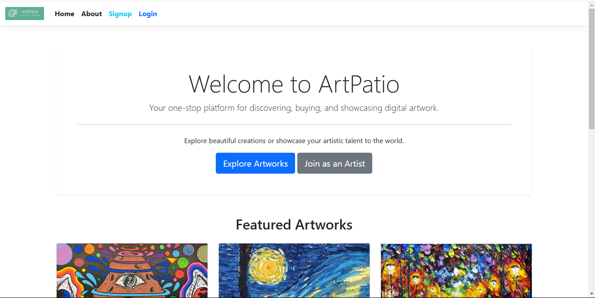
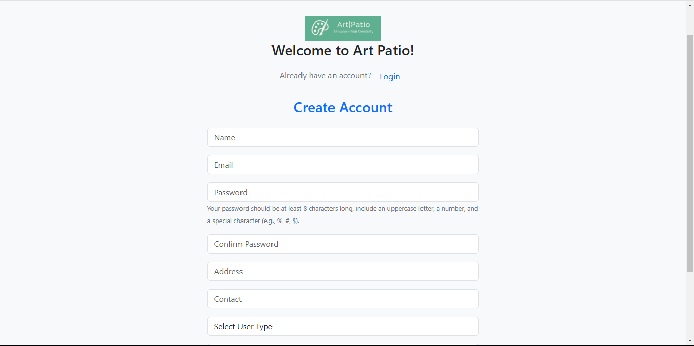
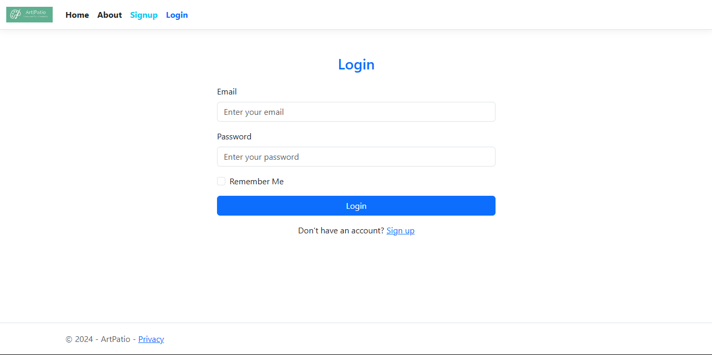
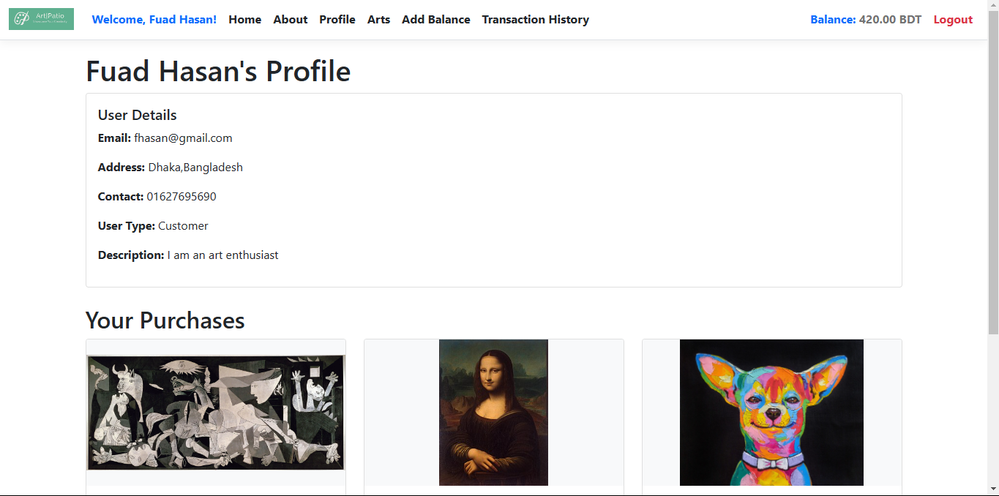
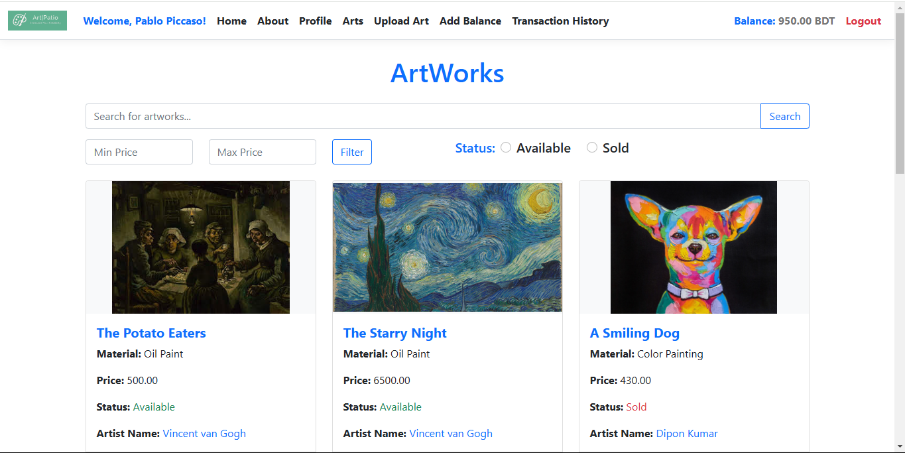
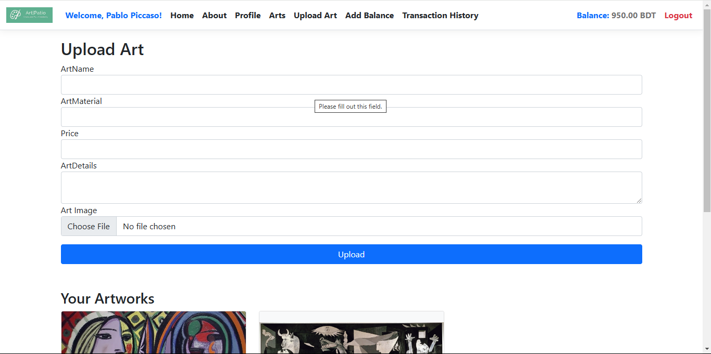
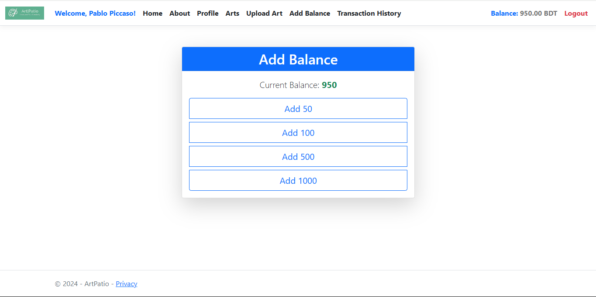
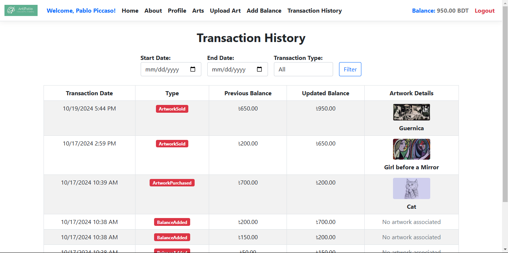

# ArtPatio

ArtPatio is a digital art gallery platform where artists can showcase their artwork, customers can purchase pieces, and gallery owners can post upcoming events. The project includes secure user authentication, multiple user roles, and robust security features to protect data and manage access.

---

## Table of Contents
- [Features](#features)
- [Screenshots](#screenshots)
- [Tech Stack](#tech-stack)
- [Installation](#installation)
- [Usage](#usage)

---

## Features

- **User Roles**: Supports four roles: Artist, Customer, Gallery Owner, and Admin.
- **User Authentication**: Multi-factor authentication for account security.
- **Artwork Uploads**: Artists can upload and display artwork with unique names for integrity.
- **Event Management**: Gallery owners can create and display upcoming events.
- **Secure Transactions**: Customers can purchase artwork with secure payment options.
- **Balance Tracking**: Real-time balance display for Customers and Artists in the navbar.
- **Audit Logs**: Records actions like artwork uploads, event creation, and profile changes.

---

## Screenshots

- **Homepage**  
  

- **Registration Form**  
  

- **Login Form**  
  

- **User Profile**  
  

- **Arts**  
  

- **Upload Art**  
  

- **Add Balance**  
  

- **Transaction History**  
  

---

## Tech Stack

- **Front-end**: HTML, CSS, JavaScript
- **Back-end**: ASP.NET Core MVC, ADO.NET
- **Database**: SQL Server

---

## Installation

Follow these steps to set up the ArtPatio project locally:

### Prerequisites

- [.NET SDK](https://dotnet.microsoft.com/download) (version matching your project's requirements)
- [SQL Server](https://www.microsoft.com/en-us/sql-server/sql-server-downloads) or another compatible database
- [Git](https://git-scm.com/) for cloning the repository

### Steps

1. **Clone the repository**:
   ```bash
   git clone https://github.com/yourusername/artpatio.git
2. **Navigate to the project directory**:
   ```bash
   cd artpatio
3. **Set up the database:**
   - Import the SQL files for the UserProfile and Artworks tables (defined below in Database Schema).
   - Update connection strings in appsettings.json to point to your database.
4. **Install dependencies:**
   ```bash
   dotnet restore
5. **Run the application:**
   ```bash
   dotnet run
6. ***Open your browser*** and go to http://localhost:5000 to view the site.

---
## Usage
- **Homepage:** View artwork collections, login, and explore events.
- **User Roles:**
  - **Artist:** Upload and manage artwork.
  - **Customer:** Purchase artwork and manage account balance.
  - **Gallery Owner:** Post and manage events.
  - **Admin:** Manage users, view audit logs, and oversee security settings.
- **Add Balance:** Use the balance management feature to add funds directly from the navbar.


